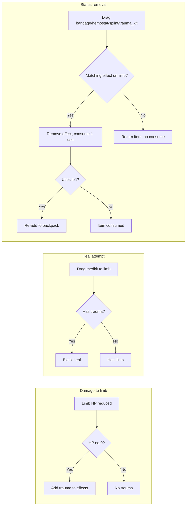

# Bleeds, Breaks, Trauma and Medical Items

## 1. Limb effects data model

- **Current:** Each limb in [game.js](c:\Users\TheGreyBeard\OneDrive\Desktop\LovelyLadyLumps\game.js) is `{ hp, maxHp, status }` (see `getDefaultLimbHp()` ~1027 and usage at 9174).
- **Change:** Add an `effects` array to each limb: `effects: []` holding string codes: `'minor_bleed'`, `'major_bleed'`, `'break'`, `'trauma'`. Keep `status` for backward compatibility; in the health UI, derive the displayed status string from `effects` (e.g. map codes to "Minor bleed", "Major bleed", "Break", "Trauma" and join with ", "). If `effects` is empty, show "—".
- **Migration:** In the existing limb migration block (~7379), ensure each limb has `effects` (default `[]` if missing); optionally normalize old `status` into `effects` if you want to support legacy saves.

## 2. Trauma application and healing block

- **Where damage is applied:** In the player damage block (~11808–11820), after `limb.hp = Math.max(0, (limb.hp || 0) - take)`, if that limb’s `hp` is now 0, add `'trauma'` to that limb’s `effects` array if not already present.
- **Block medkit healing:** In the health-view drop handler (~9400–9425), when the dragged item is a medkit (or any HP-heal item), if the target limb has `'trauma'` in `effects`, do not heal: restore the item to the backpack and return (optionally play a short "error" cue or show floating text "Trauma - use Trauma Kit first").

## 3. New items definition

In [game.js](c:\Users\TheGreyBeard\OneDrive\Desktop\LovelyLadyLumps\game.js):

- **CONFIG.LOOT.VALID_IDS:** Append `'bandage'`, `'hemostat'`, `'splint'`, `'trauma_kit'`.
- **CONFIG.LOOT.INVENTORY_ITEMS:** Add four entries (all `category: 'medical'`):
  - **bandage:** 1x1, stackMax 1, label "Bandage", icon e.g. "Bd", **color** for red (e.g. `#cc2222` or equivalent for inventory text).
  - **hemostat:** 1x1, stackMax 1, label "Hemostat", icon "Hs", same red.
  - **splint:** 1x1, stackMax 1, label "Splint", icon "Sp", same red.
  - **trauma_kit:** 2x2, stackMax 1, label "Trauma Kit", icon "TK", **color** orange (e.g. `#ff8800`).

Use a single red tint for the three 1x1 items and orange for the 2x2 trauma kit as specified.

## 4. Durability (uses) for new items

- **placeItem (~1798):** Extend the durability block so that when `itemId` is `bandage`, `hemostat`, or `splint`, set `placement.durability` / `placement.maxDurability` to 2; when `itemId` is `trauma_kit`, set to 4. Use `extra` when provided, otherwise these defaults. Consider a small helper e.g. `getDefaultDurability(itemId)` used here and elsewhere to avoid repeated conditionals.
- **applyLoot:** For grid adds, when adding `bandage`/`hemostat`/`splint` pass `extra: { durability: 2, maxDurability: 2 }`; for `trauma_kit` pass `extra: { durability: 4, maxDurability: 4 }`. Add a `switch (id)` case for each new item (after `medkit`) that calls `tryAddItem(backpack, id, 1, extra)` with the correct `extra` and sets floating text (e.g. "BANDAGE (2/2)").
- **All other durability branches:** The code currently hardcodes durability for `helmet`/`headset`/`vest`/`medkit` in several places (e.g. ~4608, 9315, 9410, 9451, 9480, 9531). Extend these to include the four new item ids with the same defaults (2/2 or 4/4), or refactor to use `getDefaultDurability(itemId)` where appropriate so new items are supported in tooltips, drag preview, and re-add-after-use logic.

## 5. Using status-removal items on limbs (drag-to-limb)

In the same `onPointerUp` branch where medical items are dropped onto `limbZones` in health view:

- **Medkit (existing):** Keep current behavior but skip healing when limb has `'trauma'` (see §2).
- **Bandage / Hemostat / Splint / Trauma kit:**
  - Define a mapping: `bandage` → removes `'minor_bleed'`, `hemostat` → `'major_bleed'`, `splint` → `'break'`, `trauma_kit` → `'trauma'`.
  - When the dropped item is one of these, check the target limb’s `effects` for the corresponding code. If present, remove one instance of that code from `effects`, consume one use (decrement `durability`). If `durability` becomes 0, do not re-add the item (item is consumed). If `durability` > 0, re-add to backpack with updated `durability`/`maxDurability`. If the limb does not have the matching effect, do not consume the item (restore to backpack as-is).
  - Play an appropriate sound and rerender.

This keeps behavior clear: only consume a use when the item actually removes the intended effect on that limb.

## 6. Inventory display (item color)

- In the backpack grid drawing loop (~9236–9243), the item text currently uses a fixed fill (e.g. `'#e0e0e0'`). If the item’s config has a `color` (or `tint`) property, use it for the text fill so that bandage/hemostat/splint render red and trauma_kit orange. Apply the same color logic anywhere else that draws these items (e.g. tooltip or drag preview) for consistency.

## 7. Loot tables

- Add the new item ids to `CONFIG.LOOT.LEVEL_POOLS` for some levels (e.g. bandage/hemostat/splint in mid levels, trauma_kit in later or rarer pools) so they can appear as world loot. Exact distribution can be tuned later.

## 8. When bleeds/breaks are applied (later phase)

- **Not in this implementation:** Do not add logic yet that applies `minor_bleed`/`major_bleed`/`break` on taking damage. Only **trauma** is applied in this phase (when limb HP reaches 0).
- **Later:** You can add e.g. chance to apply minor/major bleed or break on hit, then implement bleed damage-over-time and break penalties (e.g. damage when walking on broken leg, or when shooting with broken arm) in a follow-up.

## Flow summary

## Files and key locations

- **All in [game.js](c:\Users\TheGreyBeard\OneDrive\Desktop\LovelyLadyLumps\game.js):**
  - Limb defaults and migration: `getDefaultLimbHp`, `LIMB_MAX_HP`, migration block ~7379.
  - Item config: `CONFIG.LOOT.VALID_IDS`, `CONFIG.LOOT.INVENTORY_ITEMS`, `CONFIG.LOOT.LEVEL_POOLS`.
  - Durability: `placeItem` ~~1789; all branches that use durability defaults for specific item ids (~~1798, 4608, 9315, 9410, 9451, 9480, 9531).
  - Damage to limbs: ~11808–11820 (add trauma when limb hp becomes 0).
  - Health view: limb status display ~9191 (derive from `effects`); limb drop handler ~9399–9426 (medkit + trauma check; bandage/hemostat/splint/trauma_kit removal logic).
  - applyLoot: ~12340 (object branch for durability in `extra`); switch cases for new ids after `medkit` ~12467.
  - Backpack grid draw: ~9236–9242 (use item color for text fill).

## Testing suggestions

- Take damage until a limb reaches 0; confirm it gets trauma and cannot be healed with medkit until trauma is removed.
- Spawn or give bandage/hemostat/splint/trauma_kit (e.g. via dev or loot), add the matching effect to a limb (temporarily or via a test), drag item onto limb and confirm effect is removed and uses decrease; confirm item is consumed when uses reach 0 and that using on a limb without the effect does not consume a use.
- Confirm new items appear in inventory with correct size (1x1 red, 2x2 orange) and that loot tables can drop them where added.

