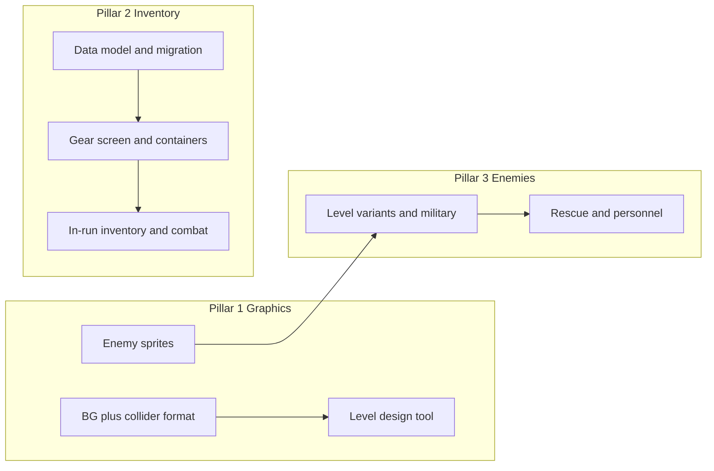

# Graphics, Inventory & Enemies Milestone Sprint

## Current state (reference)

- **Levels**: [game.js](c:\Users\TheGreyBeard\OneDrive\Desktop\LovelyLadyLumps\game.js) uses `CONFIG.ROOM_CHUNKS` (themes: STREET, APARTMENT, etc.) with `walls: [{ x, y, scaleX, scaleY }]`, 32x32 wall texture, 800x600 room, floor as tiled texture. No PNG background or editor.
- **Weapons**: Player has `currentWeapon` plus `hasShotgun`, `hasSMG`, `hasCrossbow`, `hasRifle`; magazines per weapon; no primary/secondary/sidearm/melee *slots*. Melee is implicit (E key).
- **Armor**: `stats.armor: { head, body, arms, feet }`; helmet/vest pickups set head/body. No "rig" container. In-run inventory UI: [createInventoryUI / updateInventoryUI](c:\Users\TheGreyBeard\OneDrive\Desktop\LovelyLadyLumps\game.js) (~8562–8660) shows armor slots + single 12x12 backpack grid.
- **Enemies**: [CONFIG.ENEMIES](c:\Users\TheGreyBeard\OneDrive\Desktop\LovelyLadyLumps\game.js) (WALKER, LEAPER, BANDIT, SPITTER, EXPLODER); textures are generated or single images (e.g. leaper_idle_0/1). Spawn logic uses level grid theme and `ENEMIES_PER_LEVEL`; no level-specific variants or rescueable NPCs.

---

## Pillar 1: Graphics overhauls

**1.1 Pixel-art background + colliders**

- Add support for an optional **per-chunk background image** (e.g. PNG 800x600). In `setupRoom` ([game.js](c:\Users\TheGreyBeard\OneDrive\Desktop\LovelyLadyLumps\game.js) ~8812): if chunk has `backgroundImage` key, load/display it (e.g. `this.add.image(400, 300, key).setDisplaySize(800, 600).setDepth(0)`) instead of or behind the current tileSprite floor.
- Collision stays data-driven: chunk still defines `walls` array. Art is visual only; you (or a tool) place collision rectangles that export to the same `{ x, y, scaleX, scaleY }` format. No change to physics.

**1.2 Level design tool**

- **Option A (recommended)**: Standalone HTML/Canvas (or minimal Phaser) page: load 800x600 PNG, draw rectangles for walls (snap to 32px optional), place spawn/crate/door points, export JSON matching one `ROOM_CHUNKS` entry. No game code dependency; paste or load JSON into `CONFIG.ROOM_CHUNKS` or a separate custom chunk list.
- **Option B**: In-game editor scene (e.g. dev-only): same functionality inside the project; requires a way to load/save chunk JSON (e.g. localStorage or file export).

Deliverable: one tool (A or B) that produces chunk JSON with `walls`, `spawnPoints`, `crateSlots`, `doorPositions`, and optional `floor`/`backgroundImage`, so levels can be designed visually and cycled quickly.

**1.3 Enemy sprites**

- Replace generated/placeholder textures for all enemy types with pixel-art sprites: Walker, Leaper, Bandit, Spitter, Exploder (and Boss/Necromancer if desired). Ensure sprite keys and sizes align with current usage (e.g. [ENEMIES.TEXTURE](c:\Users\TheGreyBeard\OneDrive\Desktop\LovelyLadyLumps\game.js), 32x32 or existing frame size). Add to preload and CONFIG references.

---

## Pillar 2: Tarkov-style inventory

**2.1 Data model**

- **Weapon slots** (replace single current + hasX flags): e.g. `equippedWeapons: { primary: null, secondary: null, sidearm: null, melee: null }` where each slot holds an item ref (e.g. `{ itemId: 'shotgun', ... }` or placementId into a "weapons" pool). Primary/secondary = two main guns (e.g. shotgun + rifle), sidearm = pistol, melee = knife/melee item.
- **Containers**: Keep `backpack` as main grid. Add **rig** (equippable container with its own grid, like ammo_box) and **pockets** (small fixed grid, e.g. 2x2 or 4 slots). So: character has slots for armor (head/body), rig, backpack; each container has `gridW`, `gridH`, `items`.
- **Backpack/rig as items**: Rig and backpack can be items in stash that you "equip" into the character slot; when equipped their grid is the active container. Define in CONFIG.LOOT (e.g. rig types, backpack types) and in DEFAULT_STATS / persistent.

**2.2 Hideout “gear” screen (Tarkov-like)**

- New or heavily revised **Character/Gear** tab: character silhouette (or simplified panel) with **dedicated slots**: Primary, Secondary, Sidearm, Melee, Head (helmet), Body (armor), Rig, Backpack. Each slot shows equipped item; click/drag to equip from stash or from another slot.
- **Container panels**: When Rig or Backpack is equipped, show their grid(s) (like current backpack grid). Stash remains a separate large grid. Drag-and-drop between stash, pockets, rig, backpack, and weapon/armor slots; same interaction model as current stash tab (pointer down/up, drop validation).
- **In-run inventory**: Same slot + container model: show equipped weapons, armor, rig, pockets, backpack. All moveable/organize/drop in-mission; dropping removes from current container and can spawn pickup in world or discard.

**2.3 Gameplay wiring**

- **Combat**: Primary/secondary/sidearm determine what’s available for weapon swap (e.g. scroll or 1/2/3); melee slot used for E. Reload/magazine state per equipped gun (existing magazine logic per weapon type).
- **Loot**: Pickups go to appropriate container (e.g. ammo to rig or backpack by rule; or player chooses default). If no space, existing “full” handling.

**2.4 Migration**

- Map existing `hasShotgun`/hasSMG/etc. and `currentWeapon` + `stats.backpack` into new model (one-time migration in load/save or on version bump): e.g. put owned weapons into stash or into primary/secondary/sidearm; keep backpack items; helmet/vest → head/body.

---

## Pillar 3: Enemies and hideout NPCs

**3.1 Level-specific enemy variants**

- Introduce **variant** or **skin** per enemy type (e.g. `police_walker`, `police_tank`) without duplicating full AI. Options:
  - **A**: New CONFIG entries (e.g. `ENEMIES.POLICE_WALKER`) that extend base stats (more HP/armor, same AI). Spawn tables per level theme (e.g. level 1 street: 80% walker, 20% police_walker).
  - **B**: Same ENEMIES entries with a `variant` or `theme` field per level (e.g. level 1 theme "street" → walker variant "police"); visuals and maybe a small stat modifier.
- **Military / DEVGRU-style**: Same idea—new variant or new type (e.g. `military_bandit`) with distinct sprite and tuned stats (accuracy, HP, aggression). Assign to specific levels (e.g. mall, cemetery) via spawn composition in level config.

**3.2 Rescueable NPCs**

- **Rescue mechanic**: In-level entity (e.g. “survivor” or “prisoner”) that player can interact with (e.g. F); on rescue, they’re added to persistent “hideout personnel” list.
- **Hideout**: New data (e.g. `persistent.hideoutPersonnel: [{ id, name, role, state }]`). UI in Hideout (new section or tab): list of personnel; each can have a **task** (e.g. “resting”, “crafting”, “available”) and optionally **run** state (e.g. “on mission” with timer).
- **Tasks**: Passive bonuses or production (e.g. “assign to generator” for small income over time; “assign to crafting” to reduce craft time). Design scope: define 1–2 task types first, then expand.
- **Runs**: Optional—personnel can be sent “on a run” (consume time or a resource, return with loot/currency). Defer full design to a follow-up if needed; minimal version: “Send on run” button + callback after delay with simple reward.

---

## Suggested order and dependencies

- **Phase 1**: 1.1 (background + colliders), 1.3 (enemy sprites), 2.1 (inventory data model + migration). Unblocks tools and UI.
- **Phase 2**: 1.2 (level tool), 2.2 (gear screen + rig/pockets), 3.1 (level-specific + military variants).
- **Phase 3**: 2.3 (in-run inventory and combat wiring), 3.2 (rescue + personnel + tasks/runs).

---

## Files and config to touch (summary)

| Area                | Files / locations                                                                                                                                                                    |
| ------------------- | ------------------------------------------------------------------------------------------------------------------------------------------------------------------------------------ |
| Background + chunks | [game.js](c:\Users\TheGreyBeard\OneDrive\Desktop\LovelyLadyLumps\game.js): preload (image), setupRoom, CONFIG.ROOM_CHUNKS or custom chunk source                                     |
| Level tool          | New HTML/JS (or new scene) + optional endpoint to load chunk JSON                                                                                                                    |
| Enemy sprites       | [game.js](c:\Users\TheGreyBeard\OneDrive\Desktop\LovelyLadyLumps\game.js): preload, CONFIG.ENEMIES.TEXTURE (or animation keys)                                                       |
| Inventory model     | [game.js](c:\Users\TheGreyBeard\OneDrive\Desktop\LovelyLadyLumps\game.js): DEFAULT_STATS / DEFAULT_PERSISTENT, save/load, CONFIG.LOOT (rig/backpack types)                           |
| Gear screen         | [game.js](c:\Users\TheGreyBeard\OneDrive\Desktop\LovelyLadyLumps\game.js): Hideout CHARACTER tab or new “Gear” tab, drag-drop like stash; in-run createInventoryUI/updateInventoryUI |
| Enemies             | [game.js](c:\Users\TheGreyBeard\OneDrive\Desktop\LovelyLadyLumps\game.js): CONFIG.ENEMIES, level spawn composition (per theme or level index), new sprite keys                       |
| NPCs                | [game.js](c:\Users\TheGreyBeard\OneDrive\Desktop\LovelyLadyLumps\game.js): persistent.hideoutPersonnel, in-level rescue entity, Hideout UI section for list + task/run               |

---

## Out of scope for this milestone

- Full “going on runs” AI for personnel (can be a stub + timer).
- New weapons or new armor items beyond what’s needed for slots (can add more later).
- Changing room size or camera; remain 800x600.

