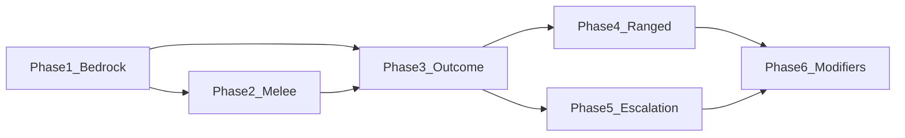

# Limb effects and damage system — phased implementation

**Status:** Phases 1–6 **implemented** in `game.js`. See HANDOVER.md and DESIGN.md (Implementation status). Test per “Testing strategy per phase” below and tune constants as needed.

Implement the system described in [DESIGN.md](c:\Users\TheGreyBeard\OneDrive\Desktop\LovelyLadyLumps\DESIGN.md) (constituent parts, melee stance, ranged pipeline, outcome tables) in **small, testable segments** so each phase is in the game and verifiable before adding the next. Contingent systems (escalation, weapon/accuracy) sit on top of a stable bedrock.

---

## Bedrock (single limb per hit + source context)

**Goal:** Every hit that goes through the new path chooses **one limb** and applies all damage and future effects to that limb. No more “random distribution across multiple limbs” for those hits. Call sites pass **source context** so later phases can use it.

**Steps:**

1. Add **limb size weights** config (e.g. `LIMB_TARGET_WEIGHT` or `LIMB_SIZE_WEIGHT`): one number per limb id—chest/abdomen largest, then legs/arms, then head/crotch (see DESIGN.md 5a(ii)). Any “pick one limb from a set” will use **weighted random** by these weights so center mass is favored; foot/hand only when the set is legs/arms or distance justifies it.
2. Add a **single-limb damage path** in [game.js](c:\Users\TheGreyBeard\OneDrive\Desktop\LovelyLadyLumps\game.js) `hitPlayer`: when `options.damageSource` (or equivalent) is set, (a) accept an optional `options.targetLimbId` from the caller, or (b) if not provided, pick one limb by **size-weighted** random from all limbs (using the new config). Apply all damage to that limb only; sync `playerStats.hp` from limb sum; trauma if limb blacks; vital death if chest/head blacked by taken damage (existing rules).
3. At each **call site** that should use the new system (bullet, acid, enemy melee overlap, explosion), pass at least `damageSource` and optionally `enemyType` / `attackType`. For this phase they do not yet pass `targetLimbId`; the fallback “pick one limb” runs (size-weighted over all limbs). Do not change pin/arm/body penalty paths.
4. **Test:** Trigger a few hits (walker melee, bullet, acid, explosion). Confirm in UI or logs that each hit affects exactly one limb and that limb’s HP and total HP update correctly. Confirm trauma appears when that limb blacks.

**Deliverable:** One limb per hit when source context is present; `hitPlayer` signature and call sites ready for limb-selection and outcome logic.

---

## Phase 2: Melee limb selection (stance)

**Goal:** Melee hits use **stance-based** limb pools: upright = arms, chest, head; on-all-fours = legs, abdomen. No outcome effects yet—only which limb is hit.

**Steps:**

1. Add config (e.g. in CONFIG or next to `LIMB_MAX_HP`): `MELEE_LIMB_POOLS.upright = ['leftArm','rightArm','chest','head']`, `MELEE_LIMB_POOLS.onAllFours = ['leftLeg','rightLeg','abdomen']`. Add a small table or map: enemyType (and optionally attackType) → `'upright' | 'onAllFours'` (e.g. walker/bandit = upright, leaper = onAllFours; pounce can be overridden to arms in a later phase).
2. In the single-limb path: when `damageSource === 'melee'` and `enemyType` is set, resolve stance, get the limb pool from `MELEE_LIMB_POOLS[stance]`, pick one limb by size-weighted random from that pool (using LIMB_TARGET_WEIGHT), set `targetLimbId` and apply damage to that limb only.
3. **Test:** Let walkers (upright) hit the player repeatedly; verify hits land only on arms/chest/head. If leaper is on-all-fours, verify legs/abdomen only. Optional: re-enable test limb flags briefly to confirm limb display.

**Deliverable:** Melee hits use stance-based pools; ranged and other sources still use fallback (size-weighted over all limbs) until Phase 4.

---

## Phase 3: Outcome roll and effects (one roll per hit)

**Goal:** For each hit that uses the new path, **one roll** decides outcome: damage only, or damage + minor_bleed, or + major_bleed, or + break, or black limb. Apply the chosen effect to the **already-chosen** limb (from Phase 1/2).

**Steps:**

1. Add **base outcome table** in config (e.g. `CONFIG.LIMB_EFFECTS` or similar): cumulative or discrete bands, e.g. damage_only 82%, minor_bleed 10%, major_bleed 5%, break 2.5%, black 0.5%. Implement a small `rollOutcome(table)` that returns one of these outcomes.
2. In the single-limb path, **after** limb is chosen and **before** applying damage: call `rollOutcome(baseTable)`. Then: (a) apply damage to the limb as now; (b) if outcome is minor_bleed/major_bleed/break and limb doesn’t already have it, push to `limb.effects`; (c) if outcome is black, set limb HP to 0 and add trauma. Do not add escalation or enemy modifiers yet.
3. **Test:** Trigger many hits (e.g. console or repeated walker); verify all five outcomes can occur and that effects show in inventory/limb UI. Verify black outcome blacks the limb and adds trauma.

**Deliverable:** Every qualifying hit gets one outcome roll and the correct effect on the chosen limb; foundation for modifiers and escalation.

---

## Phase 4: Ranged limb selection (distance bands)

**Goal:** Ranged hits (bullet, acid) choose limb from **distance bands**: close = upper body/head, medium = torso, far = legs (or miss). No weapon/accuracy yet—use one generic curve or one set of bands.

**Steps:**

1. Add config: distance thresholds (e.g. close < 100, medium < 250, else far) and per-band limb lists or weights (e.g. close = head/chest/arms, medium = chest/abdomen, far = legs). Store in same place as other limb-effect config.
2. At **ranged** call sites (bullet, acid), compute distance (attacker or projectile origin to player). In the single-limb path, when `damageSource === 'bullet'` or `'acid'`, if `targetLimbId` was not provided by caller, compute distance band and pick one limb from that band’s pool (using LIMB_TARGET_WEIGHT for size-weighted pick). Apply damage and outcome (Phase 3) to that limb.
3. **Test:** From close range take bullet/acid hits; from far range take hits. Verify close hits tend to upper body and far hits to legs (or intended bands). Optional: log distance band and chosen limb for a few hits.

**Deliverable:** Ranged attacks use distance to choose limb; melee still uses stance. Single pipeline for “pick limb then roll outcome then apply.”

---

## Phase 5: Consecutive-hit escalation

**Goal:** When the **same enemy** (or same enemy type within a short window) hits the player repeatedly, the **outcome table** shifts toward worse results (more bleeds/break/black).

**Steps:**

1. Add runtime state: e.g. `this.limbEffectHitCount = {}` keyed by enemy instance id (or enemy type + lastHitTime). When a hit is applied with a source that has an id/type, increment (or set) hit count and optionally refresh lastHitTime.
2. When rolling outcome (Phase 3), if hit count for this source is > 0, apply an **escalation curve** (e.g. +5% total to effect outcomes per hit, cap 25%): shift probability from “damage only” into minor_bleed, major_bleed, break, black (e.g. by reducing damage_only band and increasing others). Use the modified table for this hit’s roll.
3. Reset or decay hit count when the enemy dies (in enemy `takeDamage`/death callback or when overlap detects inactive enemy) or after a timeout (e.g. 15s without a hit from that source).
4. **Test:** Let one walker hit the player 1, 2, 3, 4+ times without killing it; verify later hits produce more bleeds/break/black than early hits. After killing the walker or waiting, verify next walker’s first hit uses base table again.

**Deliverable:** Ignored melee (or repeated ranged) gets progressively worse outcomes; contingent on Phases 1–3.

---

## Phase 6: Enemy/attack modifiers and optional ranged tuning

**Goal:** Different enemies (and optionally attack types) **modify** the outcome table (e.g. leaper +break, spitter +black) and, for melee, optional **overrides** (e.g. pounce → arms). Optionally add weapon or accuracy into ranged limb selection (design doc Option A or B).

**Steps:**

1. Add per-enemy (and per-attack) modifier config: e.g. `breakBonus`, `blackBonus`, `minorBleedBonus`, `majorBleedBonus` (additive % or multiplicative). When rolling outcome, merge base table with these modifiers. Add melee overrides where needed (e.g. leaper pounce → use arms pool instead of onAllFours).
2. For **ranged**, optionally implement `getRangedLimbWeights(distance, weaponId, accuracyStat)` (or simplified: distance + weapon only first): one function that returns limb weights or a single limb; call it from the ranged path when choosing limb. Wire weapon id and (if available) accuracy from bandit/spitter so future tuning is in config.
3. **Test:** Leaper melee (and pounce if implemented) gives more break; spitter acid gives more black; bandit bullet uses distance bands. Verify no regressions on walker/explosion.

**Deliverable:** Full design-doc behavior in place: stance, distance, outcome roll, escalation, and enemy-specific modifiers. Optional: weapon/accuracy for ranged as a follow-up.

---

## Dependency order

- Phase 1 is required by all.
- Phase 2 (melee) and Phase 3 (outcome) can be done in either order after 1; 3 depends on “one limb chosen” so 2 before 3 is natural.
- Phase 4 (ranged) and 5 (escalation) depend on Phase 3.
- Phase 6 depends on 4 and 5.

---

## Files to touch (summary)

- [game.js](c:\Users\TheGreyBeard\OneDrive\Desktop\LovelyLadyLumps\game.js): `hitPlayer` (single-limb path, outcome roll, limb selection helpers), overlap/call sites (pass damageSource, enemyType, distance where needed), enemy death or cleanup (reset hit count), optional `getRangedLimbWeights`.
- Config: new block (e.g. `CONFIG.LIMB_EFFECTS` or adjacent to `CONFIG.BLEED`) for outcome table, melee pools, stance map, distance bands, escalation curve, enemy modifiers.
- No new files required unless you split config into a separate file later.

---

## Testing strategy per phase

- **Phase 1:** Manual: take hits from different sources; check one limb’s HP changes and total HP; check trauma on black.
- **Phase 2:** Manual: melee only from walker vs leaper (or upright vs on-all-fours); confirm limb pools.
- **Phase 3:** Manual: many hits; confirm all outcome types appear; optional console log of outcome.
- **Phase 4:** Manual: ranged at close vs far; confirm limb distribution.
- **Phase 5:** Manual: one enemy repeated hits vs fresh enemy; confirm escalation.
- **Phase 6:** Manual: per-enemy and per-attack differences; confirm modifiers and overrides.

Re-enable or add temporary test flags (e.g. force damageSource, log chosen limb/outcome) only as needed; remove before calling the phase done.