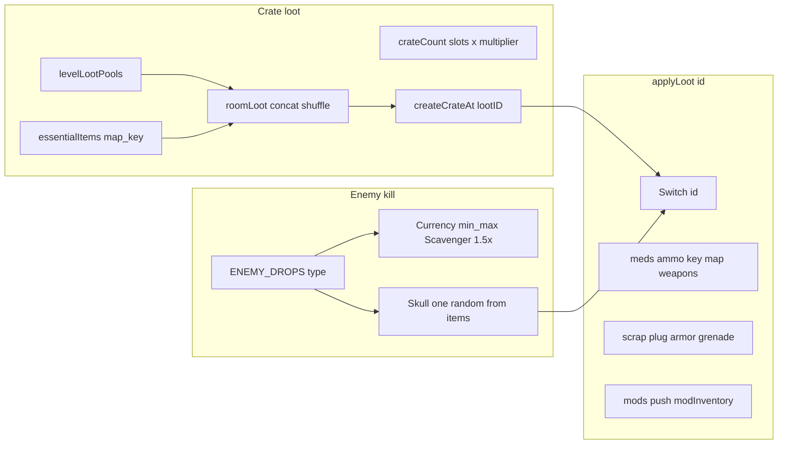

# Loot table and loot systems – exploration plan

## Current architecture

### 1. Data sources

- **CONFIG.LOOT** ([game..html](c:\Users\TheGreyBeard\OneDrive\Desktop\LovelyLadyLumps\game..html) ~268–273): Per-enemy arrays (e.g. `BANDIT`, `ZOMBIE`, `NECROMANCER`). **Not used** anywhere; drop logic uses `ENEMY_DROPS` only.
- **CONFIG.ENEMY_DROPS** (~333–342): Per-enemy type:
  - `currency` (scrap / credits / materials), `min`/`max` amount (auto-granted on kill)
  - `items`: array of item IDs; **one** random item spawns as a **skull** (pickup)
- **Level loot pools** (inline in `spawnRoomEntities`, ~7912–7920): `levelLootPools[level]` = array of item IDs for **crates** (map, key, weapons, ammo, meds, scrap, mods, etc.). Risk rooms add one random mod from `CONFIG.RISK_ROOM.GUARANTEED_DROPS` and use `LOOT_MULTIPLIER: 2`.
- **CONFIG.RISK_ROOM** (~575–581): `GUARANTEED_DROPS` = mod IDs; risk rooms get one added to pool and 2x crate count.
- **CONFIG.MODS** (~520–561): Each mod has `rarity` (`common` / `uncommon` / `rare`). **Rarity is not used** for weighting or drop logic.
- **CONFIG.CURRENCIES** (~301–305): scrap, credits, materials (names, icons, colors for UI).

### 2. Flow

- **Room crates**: Essential items (map in start room, key in first non-start for key levels) are forced; remaining pool is shuffled and assigned to crate slots (count = min(slots, pool length) × lootMultiplier). Crate positions avoid door zones.
- **applyLoot(id)** (~10214–10336): Single large `switch` for all item IDs. Handles meds, ammo, key, map, flashlight, molotov, weapons, scrap, plug, helmet, vest, grenade, and the five mod IDs. **No `case 'materials'**` – so crates/skulls with `lootID: 'materials'` (e.g. level 7 pool) do nothing when opened/picked up.
- **Scavenger class**: +50% currency amount on kill. Scrapper skill: +25% scrap.

### 3. Duplication

- **spawnLevelEntities** (~8631–8771): Hardcoded per-level `loot` arrays and `cratePos`; used for the non-procedural level flow. Overlaps in intent with procedural `levelLootPools` in `spawnRoomEntities` – two sources of “what loot per level.”

---

## Opportunities (prioritized)

### A. Bug fix: materials in crates/skulls

- Level 7 pool includes `'materials'` but `applyLoot` has no branch for it.
- **Change**: Add `case 'materials'` in `applyLoot`: e.g. grant +10 materials (and optional persistent tally), floating text, SFX.

### B. Single source of truth for level loot

- Move `levelLootPools` (and optionally essential-item rules) into **CONFIG** (e.g. `CONFIG.LEVEL_LOOT` or `CONFIG.LOOT.LEVEL_POOLS`).
- Have both procedural room spawning and `spawnLevelEntities` (if kept) read from this config so level design is data-driven and not duplicated.

### C. Use CONFIG.LOOT or remove it

- Either wire **CONFIG.LOOT** into enemy skull drops (e.g. pick table by enemy type from CONFIG.LOOT) and deprecate or merge with ENEMY_DROPS, or delete CONFIG.LOOT to avoid confusion.

### D. Rarity and weighted drops

- **Mods**: Use `CONFIG.MODS[*].rarity` when choosing mod drops (risk room guaranteed mod, boss/necromancer pools, crate pools): e.g. weight common > uncommon > rare.
- **Crates**: Optional “rarity roll” per crate (e.g. 70% from common pool, 25% uncommon, 5% rare) with small rare item pools in CONFIG.
- **Enemy skulls**: Optional second roll or weighted choice from ENEMY_DROPS items by rarity.

### E. Richer enemy drop tables

- **ENEMY_DROPS**: Add more entries (e.g. bandit-only small chance for a mod), or split `items` into weighted tiers.
- **Boss/Necromancer**: Guaranteed material bundle on kill plus existing item roll; or a small “boss only” loot table in CONFIG.

### F. Risk room and “high value” loot

- Risk room: besides one guaranteed mod, add optional guaranteed materials bundle or a second roll from a “risk-only” pool (e.g. extra meds, grenade, or rare mod).
- Optional “treasure” room type with a curated high-value table (mods, materials, key items).

### G. New item types and applyLoot

- New consumables (e.g. temporary damage boost, armor repair) or new mods: add IDs to the appropriate pools and to `applyLoot` (and CONFIG.MODS / CONFIG.CONSUMABLES if applicable).
- Keep a single place (e.g. a list or CONFIG) of all valid loot IDs so pools and `applyLoot` stay in sync.

### H. Quality of life and clarity

- Optional “rare drop” or “legendary” floating text/color for rare mods or high-value picks.
- Optional loot log (last N picks) in UI for streamers or debugging.

---

## Suggested order

1. **A** – Fix materials in `applyLoot` so level 7 (and any future) materials crates/skulls work.
2. **B** – Centralize level loot in CONFIG and use it everywhere (cleaner and easier to tune).
3. **D** – Add weighted/rarity-based mod (and optionally item) drops using existing `MODS.rarity`.
4. Then **E**, **F**, **G**, **H** as desired; **C** can be done when touching ENEMY_DROPS or CONFIG.LOOT.

If you tell me which of these you want to implement first (e.g. “fix materials + centralize level loot” or “rarity-weighted mod drops”), I can turn that into a step-by-step implementation plan.