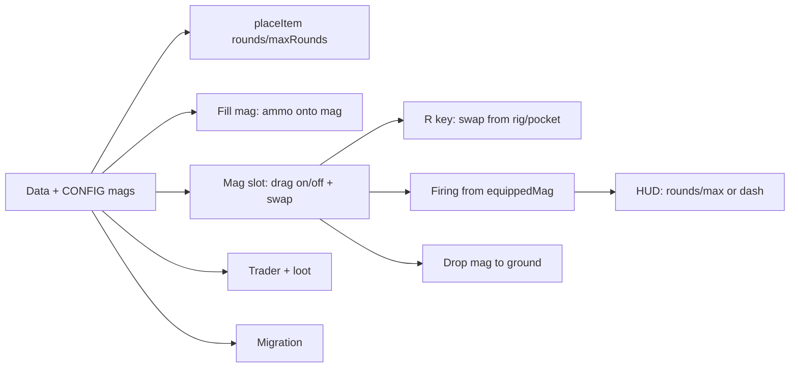

# Magazine implementation plan

Aligns with your vision: find/buy empty mags, fill by dragging ammo onto mag, R or drag to swap; mag in gun goes to rig → pockets → backpack → ground; no reload from backpack; ammo counter on weapon only (rounds/max or "-"); shotgun/crossbow show rounds in weapon; mags droppable. Uses existing [.cursor/plans/ammo_types_and_magazines.plan.md](.cursor/plans/ammo_types_and_magazines.plan.md) phases B–E and extends them with your rules.

---

## 1. Data model and CONFIG

**Magazine items (Phase B):**

- Add to [game.js](game.js) CONFIG:
  - **INVENTORY_ITEMS:** `mag_pistol` (1×1, capacity 17, weapon: pistol, color #b0b0b0), `mag_smg` (1×2, 30, smg, #505050), `mag_rifle` (1×2, 30, rifle, #c4a574). Category e.g. `magazine`. Add to VALID_IDS.
  - **CONFIG.MAGAZINES** (or on each INVENTORY_ITEMS entry): `mag_pistol` → `{ weapon: 'pistol', capacity: 17, ammoId: 'ammo_9mm' }`, same for mag_smg (ammo_45), mag_rifle (ammo_556). Used for capacity, ammo-type check when filling, and “which weapon this mag fits.”
- **Placement shape:** Grid/pocket placements for mags store `rounds` and `maxRounds` (in addition to itemId, count: 1, row, col, sizeW, sizeH). Extend `placeItem` (or callers) so `extra.rounds` / `extra.maxRounds` are copied onto the placement when placing a magazine.
- **Equipped mag state:** `playerStats.equippedMagazines[weapon]` for pistol, smg, rifle only. Shape: `{ itemId, rounds, maxRounds }` (no placementId while in gun; placement is “virtual” until swapped out). When a mag is in the weapon, it is removed from its source container; when swapped out, it is re-created as a placement in rig/pocket/backpack or dropped.

**Extended_mag and magazine slot:**

- Magazine attachment slot accepts **only magazine items** (mag_pistol, mag_smg, mag_rifle), not mods. In [game.js](game.js): add `isMagazineItem(itemId)`; in attachment-box drop logic, treat `slotName === 'magazine'` (or `'magazine_mod'`) as “accept magazine items for this weapon” (check mag’s weapon matches slot’s weaponId). Do **not** allow extended_mag to be placed in the magazine slot: either exclude extended_mag when the box is the magazine slot, or remove extended_mag from CONFIG.MODS.compatible for the magazine slot for now. Extended_mag remains in CONFIG/loot as a “unique item to flesh out later” (e.g. future mag-upgrade slot or different mechanic).

**Helpers:**

- `getMagazineWeapon(itemId)`, `getMagazineCapacity(itemId)`, `getMagazineAmmoId(itemId)` from CONFIG.
- `getEquippedMag(stats, weapon)` → equippedMagazines[weapon] or null.
- `setEquippedMag(stats, weapon, magState | null)`.
- `findFirstEmptySlotForMag(stats, sizeW, sizeH)` → { container, row, col } or { container: 'rig', row, col } etc., order: rig → pockets (by slot order) → backpack; return null if no space (then caller drops to ground).

---

## 2. Filling magazines (drag ammo onto mag)

**Drop target:** When dragging an **ammo** item (ammo_9mm, ammo_45, ammo_556) and pointer is over a **magazine placement** (in backpack, rig, or pocket), accept drop.

- **Hit-test:** In `onPointerUp` / container-drag handling, add “over mag placement” detection: for backpack/rig, iterate items and check if drag is ammo and target placement is a magazine; for pockets, check pocket slot content is a mag. Use CONFIG to ensure ammo type matches mag (e.g. ammo_9mm only for mag_pistol).
- **Logic:** Remove `toAdd = min(ammoStack.count, mag.maxRounds - mag.rounds)` from ammo source; add `toAdd` to `mag.rounds` (cap at maxRounds). If ammo stack becomes 0, remove placement; if mag is in pocket, update slot.rounds. Persist rounds on the mag placement (backpack/rig items and pocket slots already support extra fields; ensure rounds/maxRounds are written and read on placeItem/placement).
- **Edge cases:** Wrong ammo type → no-op or message. Partial fill and overflow (e.g. 10 rounds onto 15/17 mag → 17/17, 8 rounds remain in stack) must be handled.

---

## 3. Magazine slot: equip and swap (drag mag onto weapon)

**Drag mag onto weapon’s magazine box:**

- **Accept:** Only magazine items whose `weapon` matches the slot’s weaponId (e.g. mag_pistol onto sidearm pistol). Use existing attachment box zones; for `slotName === 'magazine'` (and shotgun’s `magazine_mod` if we ever add mags for shotgun later—for now only pistol/smg/rifle have mag slots), allow `isMagazineItem(drag.itemId)` and weapon match.
- **No mag in gun:** Remove mag from source (backpack/rig/pocket), set `equippedMagazines[weapon] = { itemId, rounds, maxRounds }` from that placement, clear placement from container.
- **Mag already in gun:** Swap: (1) Take current `equippedMagazines[weapon]`, call `findFirstEmptySlotForMag(stats, sizeW, sizeH)` and place that mag there (rig → pockets → backpack); if no space, **drop on ground** (create world pickup with type = { itemId, count: 1, rounds, maxRounds } or equivalent, same pattern as existing dropped items). (2) Remove dragged mag from its container and set `equippedMagazines[weapon]` to that mag’s state.

**Drag mag off weapon (from attachment box):**

- Already supported for “strip mod” from attachment box: drop onto empty cell/pocket/rig. Extend so that when the attachment box content is a **magazine** (from equippedMagazines), the payload includes `rounds` and `maxRounds`; on drop, `placeItem(..., extra: { rounds, maxRounds })` so the placed mag has the correct count. If drop target is ground (e.g. Delete key), create world pickup with mag state.

---

## 4. Reload (R key): swap from rig or pocket only

**Rule:** R does **not** use mags in backpack. Only mags in **rig or pockets** can be swapped into the gun.

- **Eligible mag:** “Best” mag in rig then pockets for current weapon (e.g. first found by slot order, or fullest; recommend “first available” for simplicity). Must be same weapon type (mag_pistol for pistol, etc.).
- **Behavior:** Same as “drag mag onto gun when gun has mag”: (1) If gun has a mag, remove it and place it in first empty slot (rig → pockets → backpack) or drop to ground if no space. (2) Take one mag from rig/pocket (not backpack), remove from container, set `equippedMagazines[weapon]` to that mag’s state. Reload timer can remain for “swap time” if desired.
- **No mag in rig/pocket:** Show message e.g. “No mag in rig/pocket” and do not move mag from backpack.

---

## 5. Firing and ammo display

**Firing:** For pistol, smg, rifle: read rounds from `equippedMagazines[weapon].rounds`. Decrement on fire; when 0, weapon does not fire (and can show “empty” or “swap mag”). Shotgun and crossbow unchanged: consume from `playerStats.magazines[weapon]` and reserve (shells from pocket/rig, bolts from backpack).

**HUD / weapon ammo counter:**

- **Mag weapons (pistol, smg, rifle):** Show `rounds/max` from equipped mag (e.g. `17/17`, `0/17`). If no mag equipped, show `-` (or `-/17` if you want to show capacity). **Remove** reserve ammo from the main HUD line (no “(45)” reserve).
- **Shotgun / crossbow:** Show rounds in weapon only (e.g. tube count or bolt), as today; no magazine.
- **Inventory panel:** Can still show reserve ammo for current weapon in the stats block for reference (optional).

---

## 6. Dropping magazines (ground)

**Delete key while dragging mag:** Same as other grid items: if drag is from backpack/rig/pocket and source is a mag, create world pickup with `type = { itemId, count: 1, rounds, maxRounds }` (and size for 1×2 if needed). Use existing `droppedInventoryItems` and pickup spawn pattern; ensure `applyLoot` or the pickup handler can add a mag to inventory with the stored rounds when collected.

**Mag swapped out with no space:** As above, create ground pickup for the mag that left the gun.

---

## 7. Trader and loot

- **Trader:** Add mag_pistol, mag_smg, mag_rifle to hideout trader stock (buy for credits); sold as **empty** (0/capacity). Trader purchase flow should create placement with `rounds: 0, maxRounds: capacity`.
- **Loot:** Bandits/crates can drop mags with random rounds (already in ammo plan Phase G). Ensure dropped mag placements have `rounds` and `maxRounds` set.

---

## 8. Migration (existing runs)

- For each weapon that has a **magazine** (pistol, smg, rifle): if `playerStats.magazines[weapon]` exists and weapon is in a slot (primary/secondary/sidearm), create **one** magazine item and equip it: `equippedMagazines[weapon] = { itemId: mag_xxx, rounds: current magazines[weapon], maxRounds: capacity }`. Optionally add one mag of that type to backpack/rig if you want a spare. Do **not** leave extended_mag in the magazine slot; clear magazine slot mod if it was extended_mag.
- Ensure `equippedMagazines` exists on all run-stats load paths (getStartingStats, GameScene init, Hideout continue, etc.) and default to null per weapon.

---

## 9. Order of implementation

1. **Data and CONFIG:** Magazine items, CONFIG.MAGAZINES (or on INVENTORY_ITEMS), equippedMagazines, placeItem/extra for rounds/maxRounds, isMagazineItem and magazine-slot-only for attachment box; extended_mag no longer in magazine slot.
2. **Fill mag:** Drag ammo onto mag (backpack/rig/pocket); validate ammo type; add rounds up to capacity; persist rounds on placement.
3. **Magazine slot:** Drag mag onto weapon (load or swap); mag-from-gun to rig → pockets → backpack → ground. Drag mag from slot to container/ground (with rounds in payload).
4. **R key:** Swap mag from rig/pocket only; same “place mag-from-gun” and “take mag from rig/pocket” logic.
5. **Firing:** Consume from equippedMagazines[weapon].rounds; block fire at 0.
6. **HUD:** Weapon line shows rounds/max or "-"; remove reserve from HUD; shotgun/crossbow keep current display.
7. **Ground drop:** Mag as world pickup with rounds/maxRounds; pickup adds mag to inventory with that state.
8. **Trader + loot:** Buy empty mags; loot mags with random rounds.
9. **Migration:** One mag per slotted pistol/smg/rifle with current round count; clear magazine-slot extended_mag.

---

## 10. Other interactions (covered or optional)

- **Wrong ammo on mag:** Rejected by ammo-type check when filling.
- **Partial fill / overflow:** Filling logic uses min(available, space left); remainder stays in ammo stack.
- **Selling mags:** Add mag_pistol, mag_smg, mag_rifle to SELL_GRID (optional; can sell partial/empty mags).
- **Double-click mag to swap:** Not in your spec; omit unless you add it later.
- **Shotgun / crossbow:** No magazine; they keep current tube/bolt and reserve behavior; no change to magazine slot for them (rifle/smg/pistol only).

This keeps your rules: find/buy empty mags, fill by dragging ammo onto mag, reload only from rig/pocket, mag-from-gun to rig → pockets → backpack → ground, ammo counter on weapon only (rounds/max or "-"), mags droppable, and extended_mag out of the magazine slot for later.