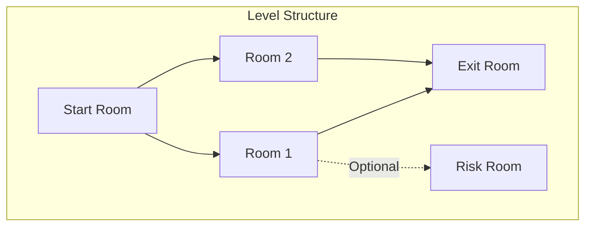

# Roguelike Elements - Milestone 8c

## Current Architecture

Levels are currently single-room with hardcoded layouts in two functions:

- `setupMapForLevel(level)` - Creates walls, floor, door placement (lines 5852-5947)
- `spawnLevelEntities(level)` - Places crates, loot, enemies (lines 5950-6078)

## New Architecture: Procedural Room Grid




### 1. Room Chunk System

Add `CONFIG.ROOM_CHUNKS` defining reusable room templates per level theme:

```javascript
CONFIG.ROOM_CHUNKS = {
    STREET: [
        { id: 'street_open', walls: [...], spawnPoints: [...], crateSlots: [...] },
        { id: 'street_alley', walls: [...], spawnPoints: [...], crateSlots: [...] },
        { id: 'street_corner', walls: [...], spawnPoints: [...], crateSlots: [...] }
    ],
    APARTMENT: [...],
    // etc for each level theme
}
```

Each chunk template includes:

- `walls` - Array of wall positions/scales relative to room bounds
- `spawnPoints` - Valid enemy spawn locations
- `crateSlots` - Valid crate positions
- `doorPositions` - Where doors can connect (north/south/east/west)

### 2. Level Grid Generation

New function `generateLevelGrid(level)` creates the room layout:

- Grid size varies by level: 2x2 for early levels, 3x2 for later
- Assigns random chunks to each grid cell
- Determines door connections between adjacent rooms
- Designates start room (player spawn), exit room (has extraction door)
- 25% chance per eligible room to have a Risk Room door

### 3. Room Transition System

Modify `GameScene` to handle multi-room levels:

- Track `currentRoom` index within the grid
- Room doors trigger room transitions (not level transitions)
- Camera/player teleport to new room position
- Each room is 800x600 (same as current canvas)
- Room state persists (cleared enemies stay dead)

### 4. Risk Room Implementation

Risk Rooms are special side-rooms with:

- **Visual**: Red-tinted door, danger symbol icon
- **Enemies**: 1.5x enemy count, +1 enemy tier (e.g., walkers become leapers)
- **Loot**: Guaranteed weapon mod drop, 2x currency drops
- **Optional**: Player can skip risk rooms entirely

## File Changes

All changes in [game.html](game.html):

### CONFIG additions (~50 lines)

- `CONFIG.ROOM_CHUNKS` - Room templates for all 7 level themes
- `CONFIG.LEVEL_GRIDS` - Grid dimensions per level (2x2 vs 3x2)
- `CONFIG.RISK_ROOM` - Risk room modifiers (enemy multiplier, loot bonuses)

### GameScene modifications (~200 lines)

- Add room state tracking: `this.roomGrid`, `this.currentRoomIndex`, `this.roomStates`
- Replace `setupMapForLevel()` with `generateRoomGrid()` + `setupRoom()`
- Replace `spawnLevelEntities()` with `spawnRoomEntities()`
- Add `transitionToRoom(roomIndex)` for room-to-room movement
- Add risk room door handling and generation
- Update door collision to check if door leads to another room vs next level

### UI updates (~30 lines)

- Mini-map showing room grid (top-right corner)
- Risk room door indicator (pulsing red glow)
- "Rooms Cleared: X/Y" display

## Backwards Compatibility

- Single-room fallback if grid generation fails
- Existing level themes/colors preserved
- Boss levels (5, 7) can remain fixed layouts or have reduced grid (2x1)
- Save data unchanged (room state is per-run only)

## Implementation Order

1. CONFIG.ROOM_CHUNKS with 2-3 chunks per level theme
2. Grid generation logic (`generateRoomGrid`)
3. Room setup from chunks (`setupRoom`)
4. Room transition system (door detection, teleport)
5. Risk room generation and mechanics
6. Mini-map UI
7. Testing and balance adjustments

