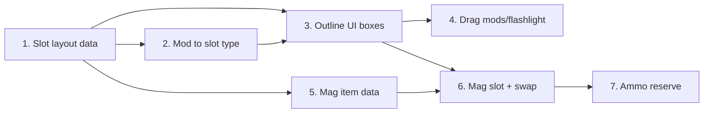

# Weapon attachments and magazines — phased plan

**Current state:** Weapon pool = slots only is implemented (`getSlottedWeaponList`, `ensureCurrentWeaponInSlots` in [game.js](game.js)). Existing mod system uses two generic slots per weapon (`equippedMods[weapon][0]`, `[1]`) and `CONFIG.MODS` (Extended Mag, Suppressor, Laser, etc.). Magazines are currently a count per weapon (`playerStats.magazines.pistol`, etc.), not items.

**Target:** Per-weapon **named attachment slots** on the weapon outline, with small boxes; **magazine** as one of those slots holding a **physical magazine item** you equip and swap when empty.

---

## 1. Data model: attachment slot layout per weapon

**Scope:** Define which slot types each weapon has and in what order. No UI yet.

- Add a **slot layout config** (e.g. in `CONFIG.WEAPONS` or a new `CONFIG.ATTACHMENT_SLOTS`):
  - **Rifle / SMG:** `['flashlight_laser', 'muzzle', 'grip', 'optic', 'magazine', 'extra']`
  - **Pistol:** `['flashlight_laser', 'muzzle', 'magazine', 'optic', 'extra']`
  - **Shotgun:** `['flashlight_laser', 'muzzle', 'magazine_mod', 'optic', 'extra']`
  - **Crossbow:** `['flashlight_laser', 'optic', 'extra']`
- Replace or extend `equippedMods` from `weapon -> [null, null]` to **slot-keyed**: e.g. `equippedMods[weapon] = { flashlight_laser: null, muzzle: null, magazine: null, ... }` so each weapon has only the keys it supports.
- Migration: existing saves with `equippedMods[weapon] = [modId, modId]` can be migrated into the new shape (e.g. map index 0/1 to 'extra' or two 'extra' slots, or drop and leave slots empty — decide in piece).
- **Test:** New run and load; no crashes; existing mod effects (mag size, damage, etc.) still apply if you keep backward compat or migrate.
- **Revert:** Remove new slot layout and restore `equippedMods[weapon] = [null, null]` and previous effect application.

**Depends on:** Nothing. Do this first.

---

## 2. Map current mods and flashlight to slot types

**Scope:** Decide which CONFIG mods and the flashlight go into which named slot, so the rest of the system can enforce compatibility.

- **Slot compatibility table:** e.g. Extended Mag → `magazine` or `magazine_mod`; Suppressor / Damage Barrel → `muzzle`; Laser Sight / Flashlight → `flashlight_laser`; Rapid Fire → `extra` (or another slot). Add to CONFIG (e.g. each mod has `slotType: 'muzzle'`) or a small lookup.
- Flashlight: treat as item/attachment that goes in `flashlight_laser` (per HANDOVER). If flashlight is currently a separate item, either make it an attachment that can be equipped in that slot or keep as item and allow it to be placed in `flashlight_laser` slot.
- **Test:** Config only; no behavior change yet.
- **Revert:** Remove slot type from mod defs.

**Depends on:** Piece 1 (so slot type names exist).

---

## 3. Weapon outline UI: small boxes per slot (display only)

**Scope:** In-run inventory (and optionally Hideout gear view), draw a **weapon outline** for each equipped weapon (primary, secondary, sidearm) with **small boxes** for that weapon’s slots only (e.g. rifle = 6 boxes, crossbow = 3). Show current attachment/mag icon or label in each box. No drag yet.

- In [game.js](game.js) `renderInventoryPanel()`, for each of primary/secondary/sidearm:
  - Resolve equipped weapon id from `weaponSlots.primary` etc.
  - Get that weapon’s slot list from the new layout config.
  - For each slot type, draw a small box (e.g. 18–22px) on the “outline” of the weapon (position: e.g. to the right of the weapon slot bar or in a row below it).
  - Label or icon per box: from `equippedMods[weapon][slotType]` (mod icon from CONFIG.MODS) or “MAG” / count for magazine slot when we have mag items; empty = “—” or blank.
- Only show outlines for weapons that are **in a slot** (primary/secondary/sidearm). Melee has no attachment outline in this spec.
- **Test:** Equip rifle, pistol, crossbow; open inventory; see correct number of boxes per weapon and correct labels. No regression on drag/drop for existing backpack/rig/weapon slots.
- **Revert:** Remove the weapon-outline and per-slot box drawing only.

**Depends on:** Pieces 1 and 2 (data and slot types exist).

---

## 4. Drag/drop: attach and detach mods (and flashlight) to/from slots

**Scope:** Attachment boxes are drop targets. Dragging from backpack/rig onto a box: if item is a valid mod or flashlight for that slot type, assign it to `equippedMods[weapon][slotType]` and remove from container. Dragging from a box: put mod/flashlight back into backpack/rig. Reuse existing effect logic (e.g. `weaponModEffects`) but keyed by the new slot-based `equippedMods` shape.

- Add hit zones for each small box (weapon id + slot type).
- On drop onto box: check drag item is mod or flashlight; check mod’s `slotType` (or equivalent) matches box; check weapon compatibility (e.g. CONFIG.MODS.compatible); then assign and remove from source.
- On drag from box: drag payload = attached mod/flashlight; drop on backpack/rig/empty cell: remove from slot, add to grid.
- Rebuild `weaponModEffects` from the new `equippedMods` shape (iterate slot types, apply mod effects). Ensure flashlight-in-slot still drives `hasFlashlight` or equivalent for lighting.
- **Test:** Equip/unequip mods and flashlight via boxes; fire weapon and see mod effects; save/load preserves attachments.
- **Revert:** Remove attachment box hit zones and drag logic; keep outline display from piece 3 if desired.

**Depends on:** Piece 3 (boxes exist and are visible).

---

## 5. Magazine as item: data and CONFIG

**Scope:** Introduce **magazine as a grid item** (e.g. `mag_rifle`, `mag_pistol`, `mag_shotgun`, `mag_smg`). Each has a capacity and can be “loaded” with rounds (e.g. 25/25). No UI for equipping into weapon yet; just data and maybe loot/stack rules.

- CONFIG: e.g. `INVENTORY_ITEMS.mag_rifle` = 1×1 or 1×2, category weapon or ammo, `capacity: 25`, `weapon: 'rifle'`. Same for pistol, shotgun, smg. Crossbow might use “magazine_mod” (e.g. quiver) or stay as single bolt.
- `playerStats.equippedMods[weapon].magazine` (or `.magazine_mod` for shotgun) can hold a **reference** to a magazine item (e.g. `{ placementId: 'backpack_xyz', itemId: 'mag_rifle', rounds: 25, maxRounds: 25 }`) or you introduce `equippedMagazines[weapon]` if you want to keep mods and mags separate in code.
- Decide: is the “magazine” in the weapon slot the **only** source of rounds for firing (swap mag when empty), or do we still have a reserve and “reload” fills the mag from reserve? User said “physical mag you equip and swap when empty” — so firing drains the equipped mag; when empty, player must swap in another mag (from backpack) or reload from reserve into that mag. Clarify in this piece: (a) mag-in-slot only, or (b) mag-in-slot + reserve ammo that can refill the mag.
- **Test:** Can add mag items to backpack; data structure supports equipped mag per weapon.
- **Revert:** Remove mag item defs and equipped mag refs.

**Depends on:** Piece 1 (magazine slot exists in layout).

---

## 6. Magazine slot UI and swap/reload behavior

**Scope:** Magazine slot on the weapon outline accepts magazine items (drag from backpack). Firing consumes from the **equipped magazine** (rounds in that mag). When mag is empty, player can swap (drag another mag onto the slot, empty mag goes to backpack) or “reload” from reserve (if you have reserve ammo) to fill the equipped mag. Ammo reserve per weapon type (Piece 7) may be needed for “reload into mag”.

- Drag mag item from backpack onto weapon’s magazine box → equip that mag in slot; if a mag was already there, swap (old mag to backpack).
- Dragging from magazine box: unequip mag to backpack (with current round count).
- Firing: decrement `equippedMagazines[weapon].rounds` (or equivalent). When 0, weapon is empty until swap or reload.
- Reload action: if reserve ammo exists (next piece), consume from reserve and add to equipped mag up to capacity; else show “no ammo” or “swap magazine”.
- **Test:** Equip mag, fire until empty, swap mag from backpack, fire again; save/load preserves mag in slot and round count.
- **Revert:** Remove mag slot interaction and firing/reload consumption from mag; restore previous magazine count logic.

**Depends on:** Pieces 3 and 5 (magazine box on outline, mag item and data exist).

---

## 7. Per-weapon ammo reserve (for reloading into mag)

**Scope:** Reserve ammo is per type (e.g. ammo_rifle, ammo_pistol). Reload action fills the **equipped magazine** from the matching reserve (from backpack or a dedicated reserve counter). Loot and CONFIG already support multiple ammo types or can be extended here.

- CONFIG: ammo types per weapon (or reuse existing single `ammo` and split later). Reserve = count in backpack (e.g. `countItemInGrid(backpack, 'ammo_rifle')`) or a dedicated `ammoReserve: { rifle: 0, pistol: 0, ... }`.
- Reload: take rounds from reserve, add to `equippedMagazines[weapon].rounds` up to mag capacity.
- **Test:** Pick up rifle ammo and pistol ammo; reload fills correct mag from correct reserve.
- **Revert:** Restore single ammo type and previous reload logic.

**Depends on:** Piece 6 (reload acts on equipped mag).

---

## Order and dependencies

- **First:** 1 (data model), then 2 (mod → slot mapping).
- **Then:** 3 (UI boxes), then 4 (mod/flashlight drag) and 5 (mag item data) in either order.
- **Then:** 6 (magazine slot + swap/reload), then 7 (reserve ammo for reload).

---

## Summary

| Piece | What                                                                               | Test                                              |
| ----- | ---------------------------------------------------------------------------------- | ------------------------------------------------- |
| 1     | Attachment slot layout per weapon (named slots); extend equippedMods to slot-keyed | No crash; mod effects still apply after migration |
| 2     | Map CONFIG mods + flashlight to slot types                                         | Config only                                       |
| 3     | Weapon outline + small boxes per slot (display only)                               | Correct boxes per weapon; labels/empty            |
| 4     | Drag mods and flashlight onto/off attachment boxes                                 | Equip/unequip; effects and save/load              |
| 5     | Magazine as grid item; data for equipped mag per weapon                            | Mag in backpack; structure supports equip         |
| 6     | Magazine slot on outline; equip/swap mag; firing drains mag                        | Swap mag; fire; reload from mag                   |
| 7     | Per-weapon ammo reserve; reload fills equipped mag                                 | Correct ammo type consumed into correct mag       |

Implement one piece at a time; test and optionally backup before the next. This keeps the feature reversible and understandable.