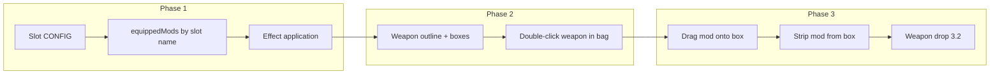

# Weapon attachments and magazines — phased plan

## Design summary

- **Reuse existing weapon slots:** Primary, secondary, sidearm, and melee slots already exist. We **tweak the existing weapon slot UI** only: add attachment boxes on (or beside) each weapon's outline. No new equip flow.
- **Weapon outline UI:** For each weapon in those slots, the existing weapon bar gets a **per-weapon outline** with **small boxes on the outline** for that weapon's attachment slots. Player drags mods onto these boxes or **double-clicks a weapon in the bag** to open that weapon’s outline and outfit it. Mods can be stripped (dragged off), weapons can be dropped.
- **Weapons in bag:** Not equippable for firing (already enforced by slot-only pool). They **can** be swapped into an existing slot and outfitted with found parts while in-game.
- **Magazines:** Physical items (e.g. Rifle Mag 25/25) that go in the magazine slot; swap when empty (separate phase after attachment system is in).

---

## Per-weapon slot layout (from your spec)

| Weapon       | Slots                                                               |
| ------------ | ------------------------------------------------------------------- |
| **Rifle**    | flashlight_laser, muzzle, grip, optic, magazine, extra_modifier (6) |
| **SMG**      | Same as rifle (6)                                                   |
| **Pistol**   | flashlight_laser, muzzle, magazine, optic, extra_modifier (5)       |
| **Shotgun**  | flashlight_laser, muzzle, magazine_mod, optic, extra_modifier (5)   |
| **Crossbow** | flashlight_laser, optic, extra_modifier (3)                         |

Flashlight (current standalone item) becomes an option for the **flashlight_laser** mount; laser sight stays as mod for that slot.

---

## Phase 1 — Data model: slot types and equipped state

**Goal:** Define which slots each weapon has and store equipped mods by slot name instead of two anonymous slots.

**Changes:**

- **CONFIG:** Add a single source of truth for weapon attachment slots, e.g. `CONFIG.WEAPON_SLOTS` or per-weapon in `CONFIG.WEAPONS`:
  - `rifle`: `['flashlight_laser', 'muzzle', 'grip', 'optic', 'magazine', 'extra_modifier']`
  - `smg`: same as rifle
  - `pistol`: `['flashlight_laser', 'muzzle', 'magazine', 'optic', 'extra_modifier']`
  - `shotgun`: `['flashlight_laser', 'muzzle', 'magazine_mod', 'optic', 'extra_modifier']`
  - `crossbow`: `['flashlight_laser', 'optic', 'extra_modifier']`
- **Mod → slot mapping:** Extend each entry in `CONFIG.MODS` with a `slotType` (e.g. `suppressor` → `muzzle`, `extended_mag` → `magazine` or `magazine_mod`, `laser_sight` / `flashlight` → `flashlight_laser`, etc.). Keep `compatible` for which weapons the mod can go on.
- **equippedMods migration:** Change from `weapon: [null, null]` to `weapon: { slotName: modId | null, ... }` keyed by the slot names above. All read/write sites currently using `equippedMods[weapon][0]` / `[1]` must be updated to use slot names (or a small adapter that maps old index to a default slot for backward compatibility during migration).
- **Effect application:** In GameScene (and Hideout if it applies mod effects), build `weaponModEffects` from the new `equippedMods[weapon]` object by iterating slot names and applying each mod’s effect (same effect types as today: mag_size, suppressor, laser_sight, damage_barrel, rapid_fire). Flashlight as attachment: when `flashlight_laser` slot has a flashlight mod (or item), treat as hasFlashlight for gameplay.

**Test:** New run and load old save; ensure mod effects still apply (migration from 2 slots to named slots). No UI changes yet.

**Revert:** Restore `equippedMods` as `[null, null]` and CONFIG to current MODS without slot types; revert effect loop to array iteration.

---

## Phase 2 — Weapon outline UI (display only)

**Goal:** For each weapon type, draw a weapon “outline” (simple shape or bar) with **small boxes on it** for each of that weapon’s slots. Display only; no drag/drop yet.

**Changes:**

- In [game.js](c:\Users\TheGreyBeard\OneDrive\Desktop\LovelyLadyLumps\game.js) inventory/gear rendering — **extend the existing weapon slot drawing** (primary, secondary, sidearm at ~10397–10444): keep current slot rectangle and label; add that weapon's outline and attachment boxes. In `renderInventoryPanel` (or equivalent):
  - When showing **equipped** primary/secondary/sidearm: next to or below the weapon slot, draw that weapon’s outline and one small box per slot (from CONFIG). Label or icon per box (e.g. “Muzzle”, “Optic”). Show current mod icon/abbreviation in each box from `equippedMods[weapon][slotName]`.
  - Layout: boxes positioned “on” the outline (e.g. along a horizontal weapon bar: muzzle left, grip center, optic right, etc.). Exact coordinates can be constants per weapon type so rifle/smg share one layout, pistol/shotgun/crossbow their own.
- **Double-click weapon in bag:** When the user double-clicks a weapon item in backpack/rig (or pocket), open/focus a **weapon detail view** for that weapon: same outline + boxes for that weapon’s slots, showing current mods. Weapon can be in bag (not equipped); this view is for outfitting only. Decide where this view appears (overlay, side panel, or inline near bag) and ensure “current weapon” for outline is either the equipped one in a slot or the one just double-clicked in bag.
- No drag/drop onto boxes yet; no stripping yet.

**Test:** Equip rifle; see rifle outline with 6 boxes and current mods. Put rifle in bag, double-click it; see same outline and boxes. Same for pistol, shotgun, smg, crossbow. No regression on existing drag/drop for containers.

**Revert:** Remove outline and attachment box graphics and double-click-to-open behavior only.

---

## Phase 3 — Drag/drop and strip

**Goal:** Drag mods from backpack/rig onto attachment boxes; drag from box to strip (mod goes back to backpack/rig). Weapons can be dropped from slot (existing or 3.2).

**Changes:**

- **Attachment box hit zones:** Each small box on the outline is a drop target. Pointer/drag logic: on drop over a box, if dragged item is a mod and its `slotType` matches the box’s slot and mod is `compatible` with this weapon, set `equippedMods[weapon][slotName] = modId`, remove mod from source (backpack/rig). If weapon is in bag (double-clicked view), `equippedMods` still applies to that weapon instance (we need a clear rule: “mods on a weapon in bag” — likely we store mods per weapon id, and a weapon in bag is still “rifle” so `equippedMods.rifle` applies when it’s equipped; when it’s in bag we need to decide if we store mods per placementId or per weapon type; recommend per weapon type so swapping rifle from bag to slot keeps its mods).
- **Strip:** Drag from an attachment box: clear `equippedMods[weapon][slotName]`, add that mod back to backpack (or rig if full) with same logic as container drag.
- **Flashlight:** If flashlight is an item that goes in `flashlight_laser` slot, allow drag from backpack to that slot and back; when in slot, set `hasFlashlight` or equivalent so gameplay uses it. If flashlight is a mod in CONFIG.MODS, treat like other mods.
- **Weapon drop:** Confirm behavior: drag weapon from slot to “ground” or Delete drops it (Piece 3.2). Mods on that weapon: either stay with the weapon (dropped item has mods) or strip to backpack; specify in implementation (recommend: stay with weapon so dropped rifle can be picked up with mods).

**Test:** Equip mod from backpack onto rifle outline; fire and see effect. Strip mod from outline to backpack. Double-click rifle in bag, attach mod; move rifle to primary slot; confirm mod still there and effective. Save/load run; mods persist.

**Revert:** Remove attachment box drop zones and strip logic; keep outline display (Phase 2).

---

## Phase 4 — Magazines as physical items (later)

**Goal:** Magazine is a physical item (e.g. “Rifle Mag 25/25”) that occupies the **magazine** (or **magazine_mod** for shotgun) slot. When empty, player swaps or reloads from reserve (ammo types / reserve handling can be same or separate task).

**Deferred:** Detailed design (magazine item CONFIG, stack vs single, reload flow, reserve ammo consumption) in a follow-up plan once Phases 1–3 are stable. Slot is already reserved in the data model and UI.

---

## Dependency order

- **Phase 1** must be done first (data shape and effect application).
- **Phase 2** depends on Phase 1 (slot names and CONFIG).
- **Phase 3** depends on Phase 2 (boxes exist and are identifiable).
- **Phase 4** (magazines as items) after 1–3; magazine slot already present.

---

## Files and touchpoints

- **Existing weapon slots:** Primary, secondary, sidearm, and melee are already drawn and used for equip/drag in game.js (~10397–10444). We only **tweak** these — add attachment boxes on each weapon's outline; no new slots or equip flow.
- [game.js](c:\Users\TheGreyBeard\OneDrive\Desktop\LovelyLadyLumps\game.js): CONFIG (MODS, WEAPONS or new WEAPON_SLOTS), DEFAULT_STATS.equippedMods, all `equippedMods` and `weaponModEffects` reads (GameScene init ~~8371–8412, fire/reload/stats), Hideout mod UI (~~6961–7018), inventory render and pointer/drag (weapon slots ~10397–10444, container drag ~10454+). Double-click detection for items in backpack/rig.
- HANDOVER and [.cursor/plans/inventory_weapons_piece_by_piece.plan.md](c:\Users\TheGreyBeard\OneDrive\Desktop\LovelyLadyLumps.cursor\plans\inventory_weapons_piece_by_piece.plan.md): Update “Phase 4” to match this plan (named slots, outline per weapon, double-click from bag, magazines as items later).

---

## Out of scope for this plan

- Phase 2 UI reorg (grenade section 2.2, key item section 2.3).
- Piece 3.2 (drop weapon to ground / stash) is included here as part of Phase 3 behavior.
- Per-weapon ammo types (reserve) and full magazine reload flow — can be same phase as Phase 4 or a separate plan.

