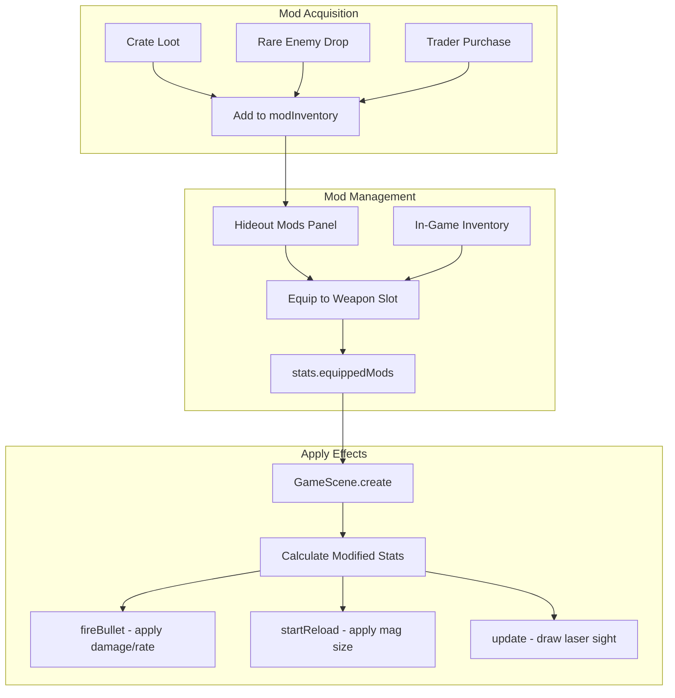

# Weapon Mods System Implementation

## Design Summary

- **5 Mod Types**: Extended Mag, Suppressor, Laser Sight, Damage Barrel, Rapid Fire
- **2 Slots Per Weapon**: Each of the 5 weapons can have up to 2 mods equipped
- **Hybrid Persistence**: Mods stored permanently in hideout inventory, equipped mods are per-run
- **Acquisition**: Loot drops from crates/enemies + Trader purchases
- **Management**: Both hideout (before run) and in-game inventory (during run)

---

## Data Structures

### CONFIG.MODS (add to [game.html](game.html) ~line 450)

```javascript
CONFIG.MODS = {
    EXTENDED_MAG: { 
        id: 'extended_mag', name: 'Extended Mag', 
        desc: '+50% magazine size', icon: 'M',
        compatible: ['pistol', 'shotgun', 'smg', 'crossbow', 'rifle'],
        effect: { type: 'mag_size', value: 0.5 },
        cost: { currency: 'materials', amount: 15 },
        rarity: 'common'
    },
    SUPPRESSOR: { 
        id: 'suppressor', name: 'Suppressor', 
        desc: 'Silent shots, -10% damage', icon: 'S',
        compatible: ['pistol', 'smg', 'rifle'],
        effect: { type: 'suppressor', damageReduction: 0.1 },
        cost: { currency: 'materials', amount: 20 },
        rarity: 'uncommon'
    },
    LASER_SIGHT: { 
        id: 'laser_sight', name: 'Laser Sight', 
        desc: 'Shows bullet trajectory', icon: 'L',
        compatible: ['pistol', 'shotgun', 'smg', 'crossbow', 'rifle'],
        effect: { type: 'laser_sight' },
        cost: { currency: 'materials', amount: 25 },
        rarity: 'uncommon'
    },
    DAMAGE_BARREL: { 
        id: 'damage_barrel', name: 'Damage Barrel', 
        desc: '+20% damage, -15% fire rate', icon: 'D',
        compatible: ['shotgun', 'rifle'],
        effect: { type: 'damage_barrel', damage: 0.2, fireRate: -0.15 },
        cost: { currency: 'materials', amount: 30 },
        rarity: 'rare'
    },
    RAPID_FIRE: { 
        id: 'rapid_fire', name: 'Rapid Fire', 
        desc: '+25% fire rate, +20% spread', icon: 'R',
        compatible: ['smg', 'pistol'],
        effect: { type: 'rapid_fire', fireRate: 0.25, spread: 0.2 },
        cost: { currency: 'materials', amount: 25 },
        rarity: 'rare'
    }
};
```

### DEFAULT_PERSISTENT additions (~line 540)

```javascript
// Weapon Mods System
modInventory: [],           // Array of mod IDs owned (e.g., ['extended_mag', 'suppressor'])
```

### DEFAULT_STATS additions (~line 480)

```javascript
// Equipped mods per weapon (per-run, 2 slots each)
equippedMods: {
    pistol: [null, null],
    shotgun: [null, null],
    smg: [null, null],
    crossbow: [null, null],
    rifle: [null, null]
}
```

---

## Implementation Flow




---

## Key Implementation Points

### 1. Loot Drops (in spawnLootSkull and crate loot)

Add mods as rare drops from crates and special enemies:

- Common mods: 5% drop chance from crates
- Uncommon mods: 3% drop chance
- Rare mods: 1% drop chance, or guaranteed from bosses

### 2. Trader Integration

Add mods to CONFIG.TRADER stock:

```javascript
MODS: [
    { id: 'extended_mag', type: 'mod', currency: 'materials', cost: 15 },
    { id: 'suppressor', type: 'mod', currency: 'materials', cost: 20 },
    // ...
]
```

### 3. Hideout UI - New "MODS" Button + Panel

Position near existing buttons (CLASS, SKILLS, UPGRADES row).
Modal shows:

- **Inventory section**: All owned mods
- **Weapon slots**: 5 weapons x 2 slots each
- Click mod in inventory, then click weapon slot to equip
- Click equipped mod to unequip back to inventory

### 4. In-Game Inventory Integration

Add mods tab/section to existing inventory screen:

- Show current weapon's equipped mods
- Allow swapping mods mid-run from inventory
- Mods in inventory persist in `modInventory`

### 5. Apply Mod Effects (GameScene)

In `GameScene.create()` after loading stats:

```javascript
// Calculate modified weapon stats based on equipped mods
this.weaponMods = {};
Object.keys(this.playerStats.equippedMods).forEach(weapon => {
    const mods = this.playerStats.equippedMods[weapon].filter(m => m);
    this.weaponMods[weapon] = this.calculateModifiedStats(weapon, mods);
});
```

Helper function `calculateModifiedStats(weapon, mods)` returns:

```javascript
{ 
    magSizeMultiplier: 1.5,  // Extended Mag
    damageMultiplier: 1.1,   // Damage Barrel
    fireRateMultiplier: 0.85, // Damage Barrel negative
    isSilent: true,          // Suppressor
    hasLaser: true           // Laser Sight
}
```

### 6. Laser Sight Rendering

In `GameScene.update()`:

- If current weapon has laser sight mod
- Draw line from player to mouse pointer (or limited range)
- Use graphics object, clear and redraw each frame

---

## Files Modified

All changes in [game.html](game.html):


| Location   | Change                                    |
| ---------- | ----------------------------------------- |
| ~line 450  | Add CONFIG.MODS                           |
| ~line 270  | Add mods to CONFIG.TRADER                 |
| ~line 480  | Add equippedMods to DEFAULT_STATS         |
| ~line 540  | Add modInventory to DEFAULT_PERSISTENT    |
| ~line 1090 | Update loadPersistent() for migration     |
| ~line 2560 | Add MODS button in HideoutScene           |
| ~line 3200 | Add showModsPanel() method                |
| ~line 3500 | Update Trader to sell mods                |
| ~line 4000 | Add calculateModifiedStats() in GameScene |
| ~line 4300 | Apply mod effects in fireBullet()         |
| ~line 4700 | Apply mod effects in startReload()        |
| ~line 5200 | Add laser sight rendering in update()     |
| ~line 4900 | Add mod drops in spawnLootSkull()         |


---

## UI Mockup - Mods Panel

```
+-------------------------------------------+
|              WEAPON MODS                  |
+-------------------------------------------+
| INVENTORY (3 mods)                        |
| [M] Extended Mag  [S] Suppressor  [L] Laser|
+-------------------------------------------+
| PISTOL      [ M ]  [   ]                  |
| SHOTGUN     [   ]  [   ]                  |
| SMG         [ S ]  [ R ]                  |
| CROSSBOW    [   ]  [   ]                  |
| RIFLE       [ D ]  [ L ]                  |
+-------------------------------------------+
| Click mod, then click slot to equip       |
|              [ CLOSE ]                    |
+-------------------------------------------+
```

---

## Migration Notes

For existing saves without mod data:

```javascript
// In loadPersistent()
if (!merged.modInventory || !Array.isArray(merged.modInventory)) {
    merged.modInventory = [];
}

// In stats loading/creation
if (!stats.equippedMods) {
    stats.equippedMods = {
        pistol: [null, null], shotgun: [null, null],
        smg: [null, null], crossbow: [null, null], rifle: [null, null]
    };
}
```

