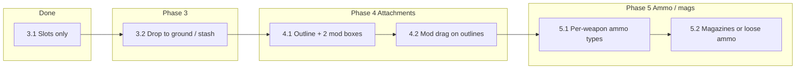

# Weapon pool, attachments, and magazines — phased plan

## Current state

- **Phase 3.1 (done):** Only weapons in `weaponSlots.primary/secondary/sidearm` are usable. Helpers in [game.js](c:\Users\TheGreyBeard\OneDrive\Desktop\LovelyLadyLumps\game.js): `getSlottedWeaponList()`, `ensureCurrentWeaponInSlots()`. Fire, reload, Q-switch, and dodge all use slotted list; `hasRifle`/`hasSMG` etc. remain for loot/challenges.
- **Existing data:** `playerStats.weaponSlots`, `playerStats.equippedMods[weapon]` = `[slot0, slot1]` (two mod slots per weapon), `weaponModEffects` computed at GameScene init from `equippedMods`. Mods are configured in `CONFIG.MODS` (extended_mag, suppressor, laser_sight, damage_barrel, rapid_fire) with `compatible` weapon list.
- **Reference plan:** [.cursor/plans/inventory_weapons_piece_by_piece.plan.md](.cursor/plans/inventory_weapons_piece_by_piece.plan.md) — Phases 3.2, 4.1, 4.2, 5.1, 5.2.

---

## Dependency order (do not reorder)

- **Phase 2 (optional):** Grenade section (2.2), key item section (2.3) — can be done in parallel or after 3.2 if UI space is needed for attachment boxes.

---

## Phase 3.2 — Drop from weapon slot to ground / stash

**Goal:** Dragging from a weapon slot can drop to ground (in-run) or to stash (Hideout); no new one-shot behavior.

**Scope:**

- **In-run:** When dragging from a weapon slot (`fromWeaponSlot`), treat Drop on “ground” (e.g. outside panel / defined drop zone) or **Delete** key as: clear that slot, spawn dropped weapon item in world (reuse existing dropped-item spawn logic). Keep existing “drop on empty backpack cell” = unequip to backpack (already there).
- **Hideout:** When dragging from a weapon slot, allow drop onto stash grid: remove from slot, add weapon to stash (same as unequip-to-backpack but target stash).

**Files:** [game.js](c:\Users\TheGreyBeard\OneDrive\Desktop\LovelyLadyLumps\game.js) — in `renderInventoryPanel()` pointer/pointerup handling where `drag.fromWeaponSlot` is handled (~11076–11092); add branches for “drop to ground” and (if in Hideout) “drop to stash”. Ensure `weaponSlots[drag.fromWeaponSlot] = null` and spawn or stash the item.

**Test:** In-run: equip weapon, drag from slot, press Delete → weapon on ground, slot empty; pick up again. Hideout: drag from slot to stash → weapon in stash, slot empty. No regression: unequip to backpack still works.

**Revert:** Remove only the new drop-to-ground and drop-to-stash branches; keep 3.1 and unequip-to-backpack.

---

## Phase 4.1 — Weapon outline + two attachment boxes (display only)

**Goal:** Show per-weapon attachment state in inventory so players see which mods are on primary/secondary/sidearm; no drag yet.

**Scope:**

- For **primary, secondary, sidearm** only (not melee): next to or under each weapon slot, draw a small “weapon row” with **two boxes** corresponding to `equippedMods[weaponId][0]` and `[1]`. Use `weaponId = this.playerStats.weaponSlots[id]` for that slot; if slot empty, show two empty boxes or skip.
- Each box shows: mod **icon** (from `CONFIG.MODS[].icon`, e.g. M, S, L) or “—” if empty. No hit detection / drag yet.

**Files:** [game.js](c:\Users\TheGreyBeard\OneDrive\Desktop\LovelyLadyLumps\game.js) — inside `renderInventoryPanel()`, after the existing weapon slot drawing (weaponSlotPos, weaponSlotIds for 0–2). Add constants for attachment box size (e.g. 16–18px), position boxes (e.g. to the right of each slot or below), loop over slot index 0–2, read `ws[weaponSlotIds[i]]` and `this.playerStats.equippedMods[weaponId]`, draw rectangles + text.

**Test:** Open in-run inventory; with rifle i